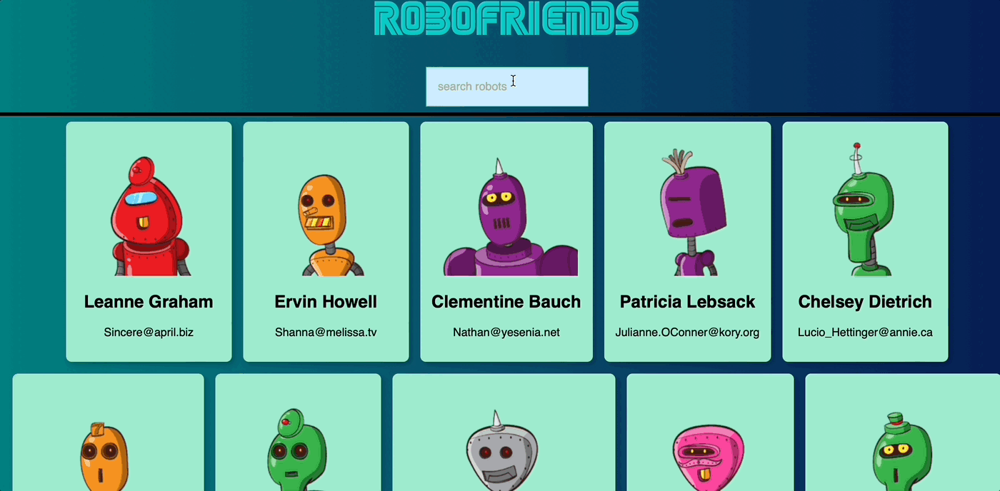

# RoboFriends




## What's inside?
What's inside this app

- This app renders list of random profile from an API.
- Each profile has it's own card component.
- Every profile gets a robot image taken from https://robohash.org
- User can filter the profile list from the SearchBox.

## Framework

This app uses <a href="https://reactjs.org/" target="_blank">ReactJS</a> framework for its development.

## Live Site

For a quick preview of the site, click the link below:

https://robofriends-2022-daniel.herokuapp.com/

## Run App Local
If you are interested on cloning this repo:
1. Clone this repo to your local machine
2. From the command-line, run
```bash
npm install
``` 

3. After the packages have been installed, start the live preview
```bash
npm start
```

## Feedback
You can also countribute or give feedback on this project.

Reach me on discord:\
https://discordapp.com/users/796539553761984565

God Bless You! 😇
